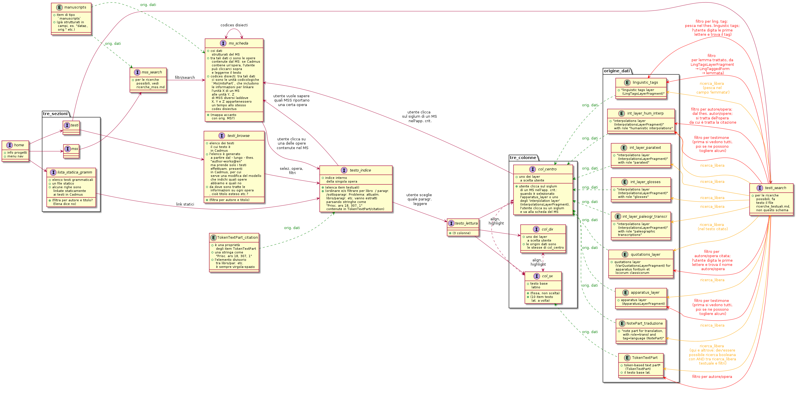

# Struttura del sito [OK]

Vd. l'immagine [schema.png](schema.png), che si può ingrandire.

# Email e altre fonti [OK]

I file di testo [e1.md](e1.md), [e2.md](e2.md) etc. in questa cartella sono email salvate.

Ho anche linkato in questa cartella alcuni appunti di riunioni: sono quelli in cui ci sono note su come dev'essere fatto l'output.
Ad esempio, in ~/pages/cadmus/output/2022-03-07_bisettimanale.md c'è un paragrafo 'Output' in cui ci sono un sacco di queste note.

## home [outdated]

- homepage: contiene header e footer con info sul progetto, similmente al [sito vetrina](https://web.uniroma1.it/pages/), ma (info) più stringate

- c'è un menu di navigazione (collocato dove?):

- due alternative per il layout della pagina
    - alternativa A (Elena?)
        - info progetto in header/footer
        - menu navigazione nel corpo della pagina
    - alternativa B (Elena?)
        - info progetto nel corpo della pagina
        - menu navigazione in barra (orizzontale/verticale)
 

## testo

### Segmentazione [riportato nell'antologia]

- Ogni schermata contiene 10 item
    - per ora iniziamo così: se poi vediamo che vengono schermate troppo grandi o troppo piccole, cambiamo

### Differenza ERC vs PRIN+ThDS [OK]

1. ERC
    - l'utente ha più layer tra cui scegliere (es.: testo critico)
2. PRIN+ThDS
    - l'utente ha meno layer, ma l'interfaccia grafica (colonne etc.) è la stessa
    - ad es. anche PRIN+ThDS *non* hanno il layer app. critico, ma *hanno* anche loro il layer annotaz. linguistica

### Layout schermi larghi [outdated]

- tre colonne verticali (col_sx, col_centro, col_dx)
- barra per la selezione dei layer
    - oppure potrebbe essere, invece che una barra, un riquadro da qualche parte in un angolo?
        - però ruba spazio a una delle tre colonne
- dimensioni colonne
    - col_sx: più grande
    - col_centro e col_dx: più piccole? (problema: la traduzione dovrebbe avere la stessa larghezza del testo lat.)
- default, quando si carica la pagina
    - col_sx: il testo lat., senza formattazione
    - col_centro: traduzione (dimensione? più piccola o uguale al testo lat.?)
    - col_dx: layer app. critico
- col_sx: fissa sul testo latino
    - solo col_centro e col_dx cambiano a seconda dei layer selezionati

### Layout schermi piccoli [outdated]

- due strisce orizzontali (top, bottom)
- l'utente clicca sulla classica icona-menu (con le tre righe orizzontali) in un angolo per aprire una colonna laterale da cui selezionare i layer
- default quando si carica la pagina
    - top: testo lat. (fisso: solo bottom cambia a seconda dei layer selezionati)
    - bottom: traduzione o app. crit.?
 

### Interazione tra colonna testo latino e le due colonne annotazioni [outdated]

1. Tutti i layer tranne 'annotaz. linguistica':
    - *Default quando si carica la pagina*: Quando due layer (es. apparato e loci similes) vengono selezionati (le colonne dovrebbero infatti essere tre), nel testo base non ci sono evidenziature: il testo lat. nella col_sx parte 'pulito'
    - *Da annotazione a testo lat.*: Quando l'utente clicca su una annotazione (ad es. su una nota di apparato, in col_centro):
        - solo allora la pericope corrispondente (il *locus varians*) viene evidenziato dinamicamente nel testo latino in col_sx
        - si evidenzia anche l'annotazione (ad es. la nota di apparato)
        - e il testo lat. si allinea all'annotazione.
    - *Da testo lat. a annotazione*: Viceversa, quando l'utente clicca su una parola latina (col_sx), se questa (che non ha per ora formattazione particolare) è parte di una pericope su cui insiste un'annotazione (ad es. è parte di un **locus varians**), succede lo stesso che ho descritto sopra, cioè in sintesi:
        - si evidenzia la pericope latina
        - si evidenzia l'annotazione
        - l'annotazione si evidenzia alla pericope latina (stavolta la pericope resta ferma, ed è l'annotaz. a 'spostarsi' per allinearsi)
    - Se hai mai usato CTE, è in pratica quel che fa CTE (e per questo lo hanno richiesto).

2) L'annotaz. linguistica funziona diversamente:
    - quando l'utente dice che in una delle due colonne a dx vuole vedere le annotazioni linguistiche
    - allora il testo base a sx si 'colora' subito, cioè tutte le pericopi su cui insistono annotazioni linguistiche si evidenziano

### Questioni aperte di formattazione/evidenziatura [outdated]
                
- quando l'utente clicca su un'annotaz. linguistica (o su testo lat. con questo tipo di annotaz.), il testo lat. è già formattato/evidenziato
    - cosa può fare il sito per mostrare che è proprio quella la pericope latina in 'focus' in quel momento?
- quando l'utente clicca su una pericope latina su cui insistono due diverse annotazioni di due diversi layer layer (diversi da annotaz. linguistica) -- ad es. una nota di apparato e una citazione?
- quando l'utente clicca su una pericope latina su cui insistono due diverse annotazioni di uno stesso layer -- ad es. due loci variantes che si intersecano (o di cui uno è un sovrainsieme dell'altro?
- quando l'utente clicca su una pericope latina su cui insiste una annotazione linguistica più una (o più) annotazioni di un altro layer?

### Formattazione dei singoli layer [outdated]

- annotazione linguistica? Dev'essere qualcosa che possa coesistere con la formattaz. di tutti gli altri layer
- apparato critico?
- citazioni?
- aggiungi qui altri layer (guardando i modelli)

## Schema pagina testo fatto da Daniele [outdated]

----------------------------

| [layer|V]                |

----------------------------

| HTML text |/meta\/transl\|

|           |              |

|           |              |

|           |              |

|           |              |

----------------------------

 

descrizione...

 

Questa qui sopra sarebbe la cornice che ho descritto sopra: un select con il layer che vogliamo evidenziare, testo HTML a sx, a dx linguette per metadati e traduzione. Il layout diviene a 1 colonna con bar, html text, e meta uno sotto l'altro nel caso troppo stretto.

Qui per ogni layer dovremmo descrivere come lo vogliamo: prendi a base il modello, e provi a metterlo sottoforma di testo come lo vedresti bene presentato.

 

## PRIN e ThDS [outdated]

### Layout home page sezione PRIN e ThDS

- si tratta delle home page di una sezione del sito, distinta dalla sezione ERC (ok?)

- elenco testi: contiene un elenco di testi grammaticali con dei filtri. Per ogni testo c'e' un pulsante che porta alla pagina che lo visualizza
    - includiamo tra i testi anche l'edizione ERC di Prisciano?
 
- ogni testo rimanda ad una pagina di tipo [Testo]

## Proposte riunione 8 marzo

Proposte emerse nella riunione bisettimanale Cadmus dell'08.03.2022:

- [da fare] indicizzare i 'group id' effettivam usati in almeno un item
- [da fare] si evidenzia il testo lat. base solo quando clicco in col_centro o col_dx
    - così evitiamo il probl. di sovrapposiz. di evidenziature
- [da fare] aggiungere mappa d'europa coi MSS come pallini
    - con slider con evoluzione secoli
        - (datazioni al quarto di secolo)
- [da fare] nella visualizzaz. di ogni item deve spuntare
    - il curatore dell'item (es. A. Consalvi)
    - quale progetto (PRIN / ThDS / ERC)

## Trasformare thes opere in item

Attualmente gestiamo la lista delle opere solo tramite un thesaurus, "author-works@en", che penso sarà la base per generare l'elenco testi_browse. Ma dato che l'elenco (autori e) opere è un dato importante e abbiamo dati aggiuntivi da 'agganciarci', attualmente contenuti nella tabella statica (la "List of the Latin grammatical works, with abbreviations and standard editions"), perché non gestirlo con veri e propri item del database?

In pratica:

1. Dal punto di vista della struttura di Cadmus, per creare questo tipo di item si potrebbe
-  ampliare il modello (cosa facile in Cadmus)
-  o utilizzare un modello già creato per altri progetti
-  o, meglio, utilizzare l'attuale 'bibliography' dando agli item con opere antiche un tag particolare che distingua chiaramente le opere antiche dalla bibliografia moderna, e i testi grammaticali all'interno delle opere antiche.

2. dal punto di vista dell'inserimento dati, una via sarebbe questa: trasformare l'attuale thesaurus "author-works@en" in una serie di item bibliografici (credo si possa fare automaticamente, come punto di partenza), e poi integrare in tale parte del database Cadmus l'attuale tabella / risorsa statica.

Se avessimo un item per (ad esempio) i Catholica Probi, questo potrebbe contenere varie proprietà come "abbreviazione", "edizioni" etc., e sarebbe da questi item che si genererebbe testi_browse. 

[...]

vecchio truciolo: 

attualmente il testo a cui appartiene ogni item non viene preso da un thesaurus, ma è una stringa libera in un campo Cadmus. Cioè: non c'è un thesaurus delle opere grammaticali. Avevamo pensato, Elena, di proporlo a Daniele, e l'avevo scritto in un'email, ma poi non ne abbiamo più parlato.
